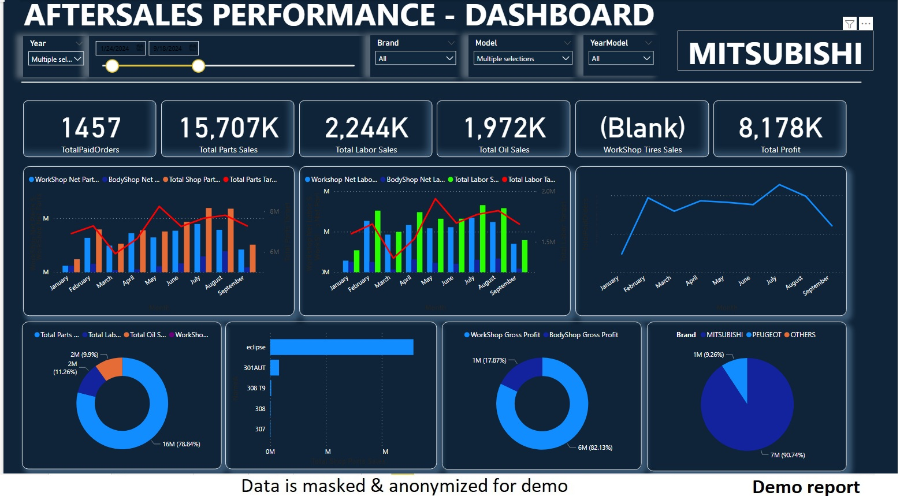

# 📊 Business Intelligence & Data Systems Portfolio

مرحبًا بك في معرض الأعمال المهني الخاص بي.  
أنا **Waleed Mohamed Osama**، *Senior Business & Systems Analyst* متخصص في:

- ذكاء الأعمال Business Intelligence  
- تحليل البيانات Data Analytics  
- نمذجة البيانات Data Modeling  
- قيادة التحول الرقمي Digital Transformation  
- تطوير حلول Power BI و SQL و ETL  
- تحسين عمليات ما بعد البيع في قطاعي السيارات والخدمات

يستعرض هذا المستودع مجموعة من الأعمال الاحترافية التي قمت بتطويرها خلال مسيرتي المهنية، بما يشمل:

✔ لوحات تحكم تفاعلية باستخدام **Power BI**  
✔ وثائق تحليل الأعمال **Business Requirements (BRD)**  
✔ وثائق تحليل الأنظمة **System Requirements (SRS)**  
✔ نماذج البيانات وخطوط معالجة البيانات **Data Models & ETL Pipelines**  
✔ نصوص **SQL** لتنظيف وتحويل البيانات  
✔ وثائق تتبع وتحليل العمليات **Process Mapping & RCA**

---

## 🗂 Documentation Index

### **📌 Business Documentation**
- 📄 **BRD – After Sales Performance**  
  `./docs/business/BRD_AfterSales_Performance.docx`

---

### **📌 System Documentation**
> *(سيتم رفع الملفات لاحقًا)*  
- 📝 SRS – After Sales Performance *(placeholder)*  
- 📝 Data Source Specification *(placeholder)*  
- 📝 Integration Flow Diagram *(placeholder)*  
- 📝 Process Workflow Mapping *(placeholder)*  

---

### **📌 Dashboards**
- 📊 **BI Hub – Landing Page**  
- 📊 **After Sales Performance Dashboard**  
- 📊 **After Sales Monthly Overview Dashboard**  
- 📊 **Financial Liquidity Dashboard**  
- 📊 **Expense Analysis Dashboard**  
- 📊 **Accounts Receivable Aging Dashboard**

---

## 🚀 أبرز المشاريع

### 1️⃣ **BI Hub – Landing Page**

الواجهة الرئيسية الموحدة لمنصة ذكاء الأعمال، والتي تضم جميع لوحات المتابعة التحليلية في مكان واحد، بهدف:

- تسهيل الوصول للـ Dashboards  
- تعزيز الرؤية التحليلية  
- دعم متخذي القرار في جميع المستويات التشغيلية والإدارية  

---

### 2️⃣ **After Sales Performance Dashboard**

لوحة أداء تفاعلية شاملة لورش الصيانة وقطع الغيار والزيوت، تشمل:

- تحليل المبيعات (Parts – Labor – Oil – Tires)  
- قياس الإنتاجية والأرباح  
- مقارنة دقيقة بين **Actual vs Target**  
- تحليل أوامر الشغل والخصومات  
- دعم كامل للفلاتر الديناميكية (Brand – Model – Month – Year)

---

### 3️⃣ **After Sales Monthly Overview Dashboard**

تحليل شهري متكامل يشمل:

- أداء الورش شهريًا  
- الربحية الإجمالية  
- نسب الإنجاز مقارنة بالمستهدف  
- عرض الانحرافات per Month  
- دعم كامل للعلامات التجارية والفروع

---

## 🧩 وثائق العمل (Business Documentation)

مجموعة من الوثائق التحليلية التي قمت بإعدادها لدعم تنفيذ الأنظمة وتحسين العمليات، وتشمل:

- **Business Requirements Document (BRD)**  
- **System Requirements Specification (SRS)**  
- **Data Source Specification**  
- **Process Workflow Mapping**  
- **Integration Flow Diagrams**

---

## 🧰 التقنيات المستخدمة

- **Power BI / DAX**  
- **SQL Server**  
- **Power Query / M**  
- **ETL Development**  
- **Excel Advanced Analytics**  
- **Business Analysis (BRD / SRS / UAT)**  
- **Process Re-engineering & Optimization**  
- **Data Modeling & Star Schema Design**

---

## 📬 تواصل معي

- 🔗 LinkedIn: https://www.linkedin.com/in/waleed-mohamed-5b85b432a  
- ✉ Email: eng.waleed_it@outlook.com  
- ✉ Email: eng.waleed.it.701@gmail.com  

